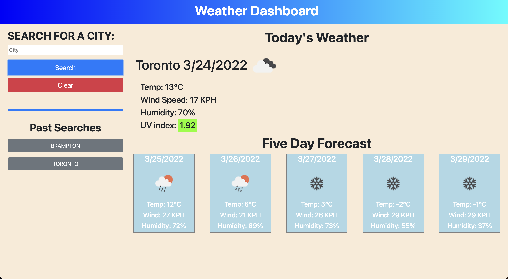

# Weather-Dashboard

## Front End Project that allows users to find current and future weather descriptions for cities of their choice. The application is formatted to be responsive and able to view properly across all screen sizes

The following application is a weather dashboard that takes user input and displays weather data on the webpage. When the user enters a valid city name, the webpage displays the current weather and a five-day forecast for that city. 

The application uses the OpenWeather API to fetch the necessary data to display the weather conditions. The current weather display includes the city name that the user inputted, along with the date (formatted and displayed using MomentJS), and an icon that represents the current weather conditions. The current weather data also includes the temperature in Celsius, the wind speed in KPH, the humidity, and the UV index. The UV index is formatted to present the user a different color depending on the amount of UVI. A UVI from 0 to 2 is considered favorable and is presented with a green background. 2.1 - 7 is moderate and is presented with a yellow background, while anything over 7 is considered severe and is presented with a red background. 

The five-day forecast is displayed under the current weather and has the following information: date (formatted and displayed using MomentJS), an icon to represent the weather of that day, the temperature in Celsius, wind speeds in KPH and humidity.

When a user inputs a city, that city is saved into the Past Searches section of the webpage. A button is dynamically created for each city that the user inputs. A unique feature about these buttons is that when they are clicked, the cities weather conditions are once again displayed on the webpage. This allows the user to easily switch between cities without having to search it again. These buttons are saved into localStorage and persist even after leaving the page and coming back. 

When a user enters an incorrect city name, they are alerted by the browser and asked to enter a valid city name. 

The following is a live link to the Weather Dashboard application: https://charanvir.github.io/Weather-Dashboard/

Below is a screenshot of the deployed application: 
- 
